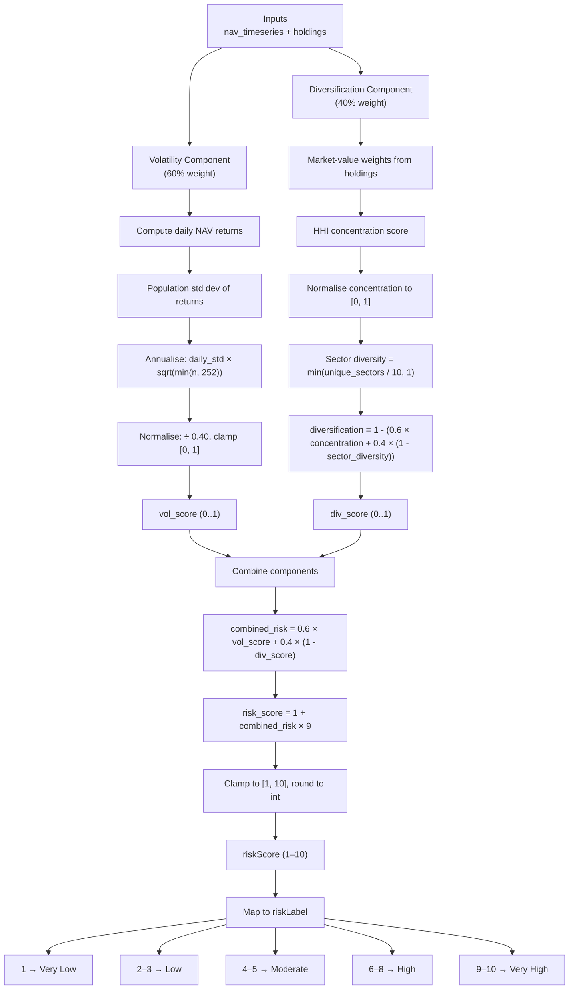

# Portfolio Risk Score & Drawdown Metrics

This document describes how the portfolio risk score and drawdown metrics are calculated in `006_get_risk_score.py`.

## Inputs

- `nav_timeseries` — List of `{"date": str, "nav": float}` dicts representing the portfolio's historical NAV. If fewer than 12 months are available, whatever data exists is used.
- `holdings` — Array of current holdings from the `portfolios` collection.
- `instruments` — Matched by `securityCode.marketCode_yf` → `symbol` to obtain sector information.

## Outputs

- `riskScore` — integer from 1 to 10
- `riskLabel` — human-readable risk category corresponding to `riskScore`
- `maxDrawdown` — float, expressed as a positive decimal (e.g. `0.25` = 25% decline)
- `maxWeeklyDrawdown` — float, same scale
- `maxYearlyDrawdown` — float, same scale

---

## Risk Score (`riskScore`)

`riskScore` is a combination of two components on a 0..1 scale, then mapped to 1..10 and rounded to the nearest integer.

### 1. Volatility component (60% weight)

1. Compute daily NAV returns from `nav_timeseries`.
2. Calculate the **population standard deviation** of those returns.
3. Annualise using:

```
annualised_vol = daily_std * sqrt(min(n, 252))
```

where `n` is the number of available returns.

4. Normalise by dividing by `0.40` (40% annualised volatility maps to `1.0`), then clamp to `[0.0, 1.0]`.

### 2. Diversification component (40% weight)

The diversification score measures how well the portfolio is spread across holdings and sectors. A higher score means better diversification.

1. **Market-value concentration (HHI)**
   - Compute the Herfindahl-Hirschman Index (HHI) of market-value weights.
   - Normalise concentration to `[0.0, 1.0]` where `1.0` represents a single-stock portfolio.
2. **Sector diversity**
   - Count unique sectors from the `instruments` collection.
   - Compute `sector_diversity = min(unique_sectors / 10, 1.0)`.
3. **Combine**

```
diversification = 1.0 - (0.6 * concentration + 0.4 * (1.0 - sector_diversity))
```

Clamped to `[0.0, 1.0]`.

### Final score

```
combined_risk = 0.6 * vol_score + 0.4 * (1.0 - div_score)
risk_score = 1.0 + combined_risk * 9.0
```

Result is clamped to `[1.0, 10.0]` and rounded to the nearest integer.

### Risk Score Calculation Flow



### Risk Label (`riskLabel`)

`riskLabel` is a human-readable category mapped from `riskScore`:

| `riskScore` | `riskLabel` |
|---|---|
| 1 | Very Low |
| 2 | Low |
| 3 | Low |
| 4 | Moderate |
| 5 | Moderate |
| 6 | High |
| 7 | High |
| 8 | High |
| 9 | Very High |
| 10 | Very High |

---

## Drawdown Metrics

All drawdown values are expressed as **positive decimals**.

### `maxDrawdown`

Scans the full NAV series and records the largest peak-to-trough decline observed between any two points.

Algorithm:

- Maintain `peak` starting at the first NAV.
- For each NAV value:
  - Update `peak` if the current NAV is higher.
  - Compute `dd = (peak - nav) / peak`.
  - Track the maximum `dd`.

### `maxWeeklyDrawdown`

Slides a **5-day** rolling window across the NAV series and records the largest peak-to-trough decline observed within any such window.

### `maxYearlyDrawdown`

Slides a **252-day** rolling window across the NAV series and records the largest peak-to-trough decline observed within any such window.

- If fewer than 252 data points are available, the window size is capped to the series length.

---

## Database Update

Each portfolio document is updated by `accountNumber`. The write uses `upsert=True`, so a document is created if it does not already exist.

Fields set:

- `riskScore`
- `riskLabel`
- `maxDrawdown`
- `maxWeeklyDrawdown`
- `maxYearlyDrawdown`

---

## Running the script

```bash
python data/006_get_risk_score.py
```

Environment variables:

| Variable | Description |
|---|---|
| `MONGODB_SRV` | MongoDB connection string |
| `DATABASE_NAME` | Database name (defaults to `VESTRA_PROD`) |
